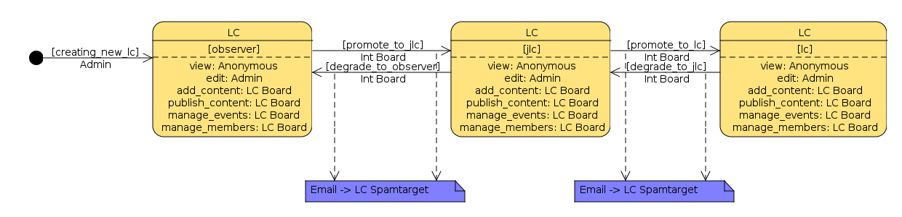
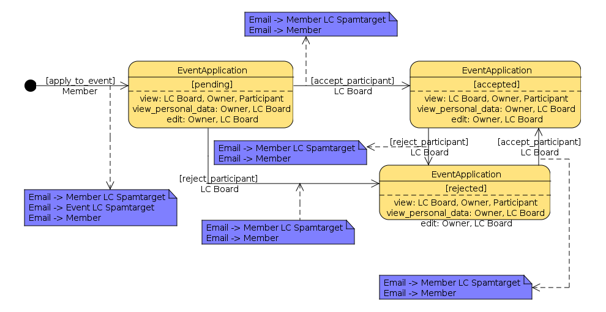

=========
Workflows
=========

Detailed descriptions of what workflows we use and the user story behind them.

Prelude
=======

This document is primarily meant for developers on the eestec.net project. It's also a recommended read for power users, such as CPs and the Board, as the reader gains valuable insight of the story behind eestec.net workflows and object relations.

The general purpose of the eestec.net portal is to standardize and enable EESTEC members to apply for events themselves and then track their application online, hence replacing the currently inefficient way of doing this though emails. 

.. note ::

    Diagrams are made in UMLet. Their source files are below each of their screenshots.

.. note ::

    By default, workflow specifications for Plone are done in XML which get kind of hard to read when they grow. Luckily we can use a great tool called 'collective.wtf' that enables us to do workflow specification in CSV format in your favorite spreadsheet editor (Calc, Excel, etc.) making specifications much more readable and developer-friendly. Read more about it here (TODO: link).

LC workflow
===========

We have different types of LCs: normal, junior, observer. Each of these types have some specific behaviour and permissions bind to them. To avoid creating separate content types for each of these types of LCs we'll rather use workflows and one content type "LC". 

LC object starts it's life cycle in state "pending" with only administrators being able to add new LCs to the site. Then administrator will check if all LCs fields are correctly set and will move LC's state to a new one, either "LC", "JLC" or "Observer". Each of these workflow states will have special permissions bindings (Observers cannot add Events, ... ). 

:download:`Download UMLet source file <lc_workflow.uxf>`.

TODO: LC can only be created by dev.

LC Content workflow
===================

All LC members can add default Plone content into their LC folder (news, pages, files, images, etc.). This content is not immediately visible by non-LC members and needs to be published first. CPs can publish such content with a single click. We'll use default Plone publication workflow for this. TODO: link to plone.org explaining default workflows

Member workflow
===============

We use Membrane/Remember framework for advanced member handling in Plone. Consequently it's much easier to add new fields to a member object and bind workflows to them. Since we need a machinery for confirming newly registered members we'll again use workflows. The default workflow that comes with Remember already supports this kind of user story and only minor customization is needed to suit our needs.

Member object starts it's life cycle in state pending with anonymous user filling out the registration form. Based on LC selection on the registration form, respective CP is given permissions over the newly created Member object and can now approve it by moving it to state "active". Upon approving, member receives an activation email and can now login to the site. There is one more state, which we'll have to add manually, the "alumni" state. CP is again responsible for transition of member from "active" to "alumni". All states also have a "disable" transition which disables the member, denying login for this member. Round trip from "disabled" back to "active" state is also supported.

.. image:: member_workflow.png

:download:`Download UMLet source file <member_workflow.uxf>`.

Event and EventApplication workflow
===================================

Now here's where the fun starts :). Events start their life cycle in state pending with CP adding a new Event object into it's LC object. Then VC-IA comes along and confirms the Event which is now in state "open_for_applications". An automatic email is sent to CP mailing list to inform everybody that we have a new Event members can apply to. Members also see this Event in the "upcoming events" listing. Upon opening a single Event members are presented with all information about an Event and an "apply for this event" button. This button creates an EventApplication in this Event. Organizer's CP and Member's CP are both notified about this via email. 

Members are able to apply until the official application deadline. After the deadline, Organizer's CP will "accept" or "reject" each pending EventApplication. 

When Organizer is happy with accepted participants he puts the Event into next workflow state, 'board_approval'. If Event is not put into board approval within 24 hours from the official deadline they are sent an email reminder to do so. VC-IA is notified of this. 

An email is sent to VC-IA requesting him/her to login to the site and approve/reject all event applications for this Event. When VC-IA is happy with the list of approved participants, he/she moves the Event into state "confirmed". All members, member's CPs and organizer CP are notified that Event is confirmed and their application is approved. 

.. image:: event_workflow.png

:download:`Download UMLet source file <event_workflow.uxf>`.

:download:`Download UMLet source file <event_application_workflow.uxf>`.

 